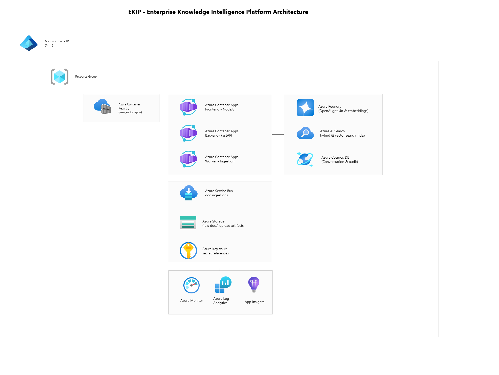

# EKIP - Enterprise Knowledge Intelligence Platform

Azure-native, enterprise-grade multi-agent RAG for ingestion, grounded answers with citations, and auditable decision support.

Built for AI Dev Days Hackathon 2025 — AI Apps & Agents track.

## Repository

- GitHub: [https://github.com/ihorsmi/EKIP](https://github.com/ihorsmi/EKIP)

## Highlights

- Multi-agent RAG flow with explicit agent responsibilities (Ingestor, Reasoner, Summarizer, Advisor, Orchestrator)
- Grounded answers with citations and provenance metadata
- Conversation history and agent event audit trail in Cosmos DB
- Azure-native deployment on Container Apps with Key Vault, Service Bus, AI Search, OpenAI, and Monitor
- Enterprise controls: Entra ID RBAC, managed identity, correlation IDs, no secrets in code

## Deployment Status

As of March 4, 2026:

- Infra baseline: deployed and stable (RG, ACR, Key Vault, Service Bus, AI Search, Cosmos DB, Log Analytics, Container Apps Environment)
- App tier on Azure Container Apps: healthy
- Backend URL: `https://ekip-backend-01.graymushroom-404701f7.northeurope.azurecontainerapps.io`
- Frontend URL: `https://ekip-frontend-01.graymushroom-404701f7.northeurope.azurecontainerapps.io`
- Active cloud image tag: `v0.1.2`
- Smoke check: `/health` passes

Known blocker:

- Azure OpenAI model deployments (`gpt-4o`, `text-embedding-3-large`) cannot be provisioned in the current subscription/region due to quota (`InsufficientQuota`).
- When those deployments are unavailable, query/chat flows can fail with `DeploymentNotFound`.

## What EKIP Does

EKIP ingests enterprise documents, indexes them for hybrid retrieval (keyword + vector), answers with citations, summarizes safely, proposes actions, and records a traceable audit trail suitable for enterprise governance.

## Capabilities

- Async ingestion pipeline: Upload -> Blob -> Service Bus -> Worker -> Azure AI Search index
- Hybrid retrieval: keyword + vector retrieval with rank-based context selection (reranking-ready design)
- Citations/provenance in every answer response (`doc_id`, filename, chunk index, score, text excerpt)
- Multi-agent responsibilities: Ingestor, Reasoner, Summarizer, Advisor
- Orchestrator concept with deterministic path and optional Agent Framework path
- Conversation history and agent event logging in Cosmos DB
- Observability via structured logs, correlation IDs, App Insights/Log Analytics integration
- Enterprise security posture with Entra ID auth mode, RBAC roles (Admin/Analyst/Viewer), Key Vault secret references, managed identities
- Containerized deployment to Azure Container Apps with images in Azure Container Registry
- Explicit Azure OpenAI quota dependency acknowledged in infra and runtime docs

## Typical Workflows

| Workflow | What users upload | What users ask | What EKIP returns | What EKIP logs |
|---|---|---|---|---|
| HR onboarding assistant | Handbook PDF, access policy TXT | "What are onboarding steps for engineers?" | Grounded summary + citations + onboarding action checklist | Conversation messages, agent events, ingest job states |
| Support desk ticket deflection | Product FAQ DOCX, troubleshooting docs | "How do I reset MFA after device loss?" | Procedure summary with source chunks + suggested support actions | Query trace with correlation ID, citations, advisor actions |
| Engineering ADR/RFC onboarding | ADR/RFC docs, architecture notes | "Why was Service Bus chosen over Redis in prod?" | Decision rationale with linked evidence chunks | Conversation history + reasoner/summarizer/advisor events |
| Legal/compliance clause lookup | Policy docs, contract clauses | "Show data retention obligations for audit logs." | Clause-focused answer + citations + follow-up controls | Audit events with timestamped query/response context |
| IT Ops/SRE incident runbook Q&A | Incident runbooks, postmortems | "What are first 5 checks for queue backlog spike?" | Prioritized runbook actions with evidence | Incident Q&A conversation trail and action recommendations |

## Architecture



```text
                         +-----------------------------------------+
                         | Microsoft Entra ID                      |
                         | AuthN/AuthZ + RBAC (Admin/Analyst/Viewer) |
                         +-------------------+---------------------+
                                             |
                                             v
+---------------------------+      +---------------------------+
| Azure Container Apps      | ---> | Azure Container Apps      |
| Frontend (Next.js)        |      | Backend (FastAPI)         |
+-------------+-------------+      +-------------+-------------+
              |                                  |
              |                                  +-------------------------------+
              |                                                                  |
              |                                                       +----------v-----------+
              |                                                       | Cosmos DB            |
              |                                                       | conversation + audit |
              |                                                       +----------------------+
              |
              |                                  +-------------------------------+
              |                                  |                               |
              v                                  v                               v
+---------------------------+      +---------------------------+     +---------------------------+
| Blob Storage (raw docs)   | ---> | Service Bus (ingest q)    | --> | Azure Container Apps      |
| upload artifacts          |      | doc-ingest                |     | Worker (ingestion)        |
+---------------------------+      +---------------------------+     +-------------+-------------+
                                                                                   |
                                                                                   v
                                                                       +-----------+-----------+
                                                                       | Azure AI Search       |
                                                                       | hybrid/vector index   |
                                                                       +-----------+-----------+
                                                                                   |
                                                                                   v
                                                                       +-----------+-----------+
                                                                       | Azure OpenAI          |
                                                                       | gpt-4o + embeddings* |
                                                                       +-----------------------+

+---------------------------+      +---------------------------+      +-----------------------+
| Azure Key Vault           |      | Azure Monitor             |      | Azure Container       |
| secret references         |      | App Insights + Log Analytics      | Registry (ACR)        |
+---------------------------+      +---------------------------+      +-----------------------+

+---------------------------+
| Azure AI Foundry Hub      |
| agent hosting/routing/evals design path |
+---------------------------+

*Current known limitation: model deployments blocked by AOAI quota in this subscription/region.
```

## Demo Video

- YouTube: [https://www.youtube.com/watch?v=pZIKpkzxnJk](https://www.youtube.com/watch?v=pZIKpkzxnJk)

## Azure Services in EKIP

| Service | Role in EKIP |
|---|---|
| Microsoft Entra ID | Identity, token validation mode, RBAC role model |
| Azure Container Apps (Frontend/Backend/Worker) | Runtime hosting for UI, API, and ingestion worker |
| Azure Container Registry (ACR) | Image registry for backend/worker/frontend containers |
| Azure Blob Storage | Raw document storage for uploaded files |
| Azure Service Bus | Async ingestion queue (`doc-ingest`) |
| Azure AI Search | Hybrid keyword + vector retrieval index |
| Azure OpenAI | Chat and embedding model inference (quota dependent) |
| Azure AI Foundry Hub | Agent hosting/model routing/evaluation design component |
| Azure Cosmos DB | Conversation state, ingest job state, and audit trail |
| Azure Key Vault | Secret storage and Container Apps secret references |
| Azure Monitor + App Insights + Log Analytics | Observability, structured telemetry, distributed trace context |

## Agents

- Ingestor: parses files, chunks text, creates embeddings, upserts searchable chunks
- Reasoner: executes retrieval strategy (vector/hybrid), selects context for grounding
- Summarizer: generates grounded answer text from selected context
- Advisor: produces follow-up actions and logs decision support artifacts
- Orchestrator: coordinates the sequence and logging

Orchestrator implementation status:

- Current default runtime path: deterministic orchestrator (fully wired)
- Optional path in code: Agent Framework orchestrator (`ORCHESTRATOR_MODE=maf`) with optional MCP tool loop toggles
- Separate Azure MCP server is not deployed as an EKIP service in the current baseline

## Azure-First Quickstart

### 1) Prerequisites and stop-ship checks

```powershell
powershell -NoProfile -ExecutionPolicy Bypass -File .\infra\scripts\00_prereqs.ps1
powershell -NoProfile -ExecutionPolicy Bypass -File .\infra\scripts\01_stopship_check.ps1
```

### 2) Deploy infra baseline

```powershell
powershell -NoProfile -ExecutionPolicy Bypass -File .\infra\scripts\02_create_rg.ps1
powershell -NoProfile -ExecutionPolicy Bypass -File .\infra\scripts\03_deploy_infra_baseline.ps1
```

### 3) Set Key Vault secrets

```powershell
powershell -NoProfile -ExecutionPolicy Bypass -File .\infra\scripts\04_set_keyvault_secrets.ps1
```

### 4) Build/push images and deploy apps

```powershell
powershell -NoProfile -ExecutionPolicy Bypass -File .\infra\scripts\05_build_push_images.ps1 -Tag "v0.1.2"
powershell -NoProfile -ExecutionPolicy Bypass -File .\infra\scripts\06_deploy_apps.ps1
```

### 5) Smoke test

```powershell
powershell -NoProfile -ExecutionPolicy Bypass -File .\infra\scripts\07_smoke_test.ps1
Invoke-WebRequest "https://ekip-backend-01.graymushroom-404701f7.northeurope.azurecontainerapps.io/health"
```

### 6) Demo flow

1. Upload synthetic docs from `data/sample_docs/`.
2. Ask grounded questions in the frontend:
   - `https://ekip-frontend-01.graymushroom-404701f7.northeurope.azurecontainerapps.io`
3. Confirm citations and action suggestions in responses.
4. Confirm conversation and agent events are persisted for audit.

## Configuration

### Core environment variables

| Variable | Purpose |
|---|---|
| `AZURE_OPENAI_ENDPOINT` | Azure OpenAI endpoint |
| `AZURE_OPENAI_CHAT_DEPLOYMENT` | Chat model deployment name |
| `AZURE_OPENAI_EMBED_DEPLOYMENT` | Embedding deployment name |
| `AZURE_OPENAI_API_KEY` | API key for local/dev key-based auth (prefer MI in Azure) |
| `EKIP_STATE_PROVIDER` | `sqlite` or `cosmos` |
| `EKIP_QUEUE_PROVIDER` | `redis` or `servicebus` |
| `EKIP_STORAGE_PROVIDER` | `local` or `azureblob` |
| `EKIP_INDEX_PROVIDER` | `qdrant` or `azuresearch` |
| `ORCHESTRATOR_MODE` | `deterministic` or `maf` |
| `AZURE_MCP_ENABLED` | Enables optional MCP tool loop when using `maf` |
| `AUTH_MODE` | `disabled`, `dev_token`, or `azure_ad` |
| `AZURE_AD_AUDIENCE` | Audience/client app id for Entra token validation |

### AOAI quota limitation and mitigation

Current blocker in this subscription/region:

- `InsufficientQuota` when provisioning `gpt-4o` and `text-embedding-3-large`
- Runtime impact: `/query` may fail with `DeploymentNotFound`

Mitigation options:

1. Use a subscription/region with available AOAI quota for both deployments.
2. Point EKIP to an existing Azure OpenAI resource where these deployments already exist.

## Security Notes

- No secrets should be committed to source control.
- Azure deployment uses Key Vault secret references and managed identities.
- RBAC role model in application path: `Admin`, `Analyst`, `Viewer`.
- Audit events (conversation and agent events) are persisted in Cosmos DB. Retention is managed via Cosmos DB and Log Analytics workspace policies.
- Telemetry and operational logs flow to Azure Monitor/App Insights/Log Analytics.

## Documentation

- [Demo quickstart](docs/DEMO_QUICKSTART.md)
- [Hard docs demo notes](docs/HARD_DOCS_DEMO_NOTES.md)
- [Data pack usage](docs/USAGE_DATA_PACK.md)
- [Troubleshooting](docs/TROUBLESHOOTING.md)
- [Submission checklist](docs/submission/CHECKLIST.md)
- [Submission demo script](docs/submission/DEMO_SCRIPT_2MIN.md)
- [Team info template](docs/submission/TEAM_INFO_TEMPLATE.md)

## License

MIT. See [LICENSE](LICENSE).

## Contributing

See [CONTRIBUTING.md](CONTRIBUTING.md).

